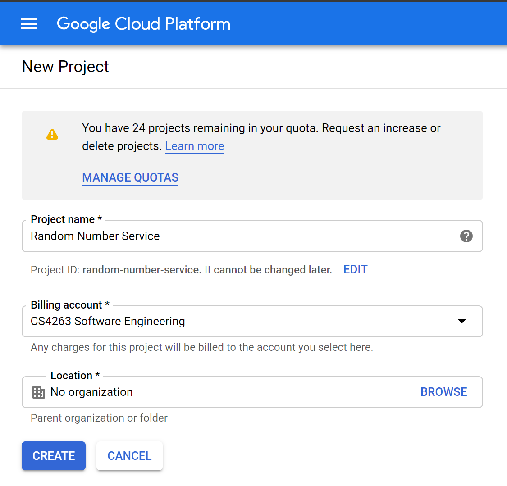

# random-number

## Live Demos:
- [Compute Engine + Java](http://35.238.248.232:8080/randnum/hello)
- [Compute Engine + Python](http://shoddy.design/)

## Prequisite for all deployments
1. Sign up for a Google Cloud Platform account  .
1. [Create a new project](https://console.cloud.google.com/projectcreate).
  
Be sure to select the correct billing account.
1. Wait while Compute Engine gets set up. App Engine deployments can happen during this time.
