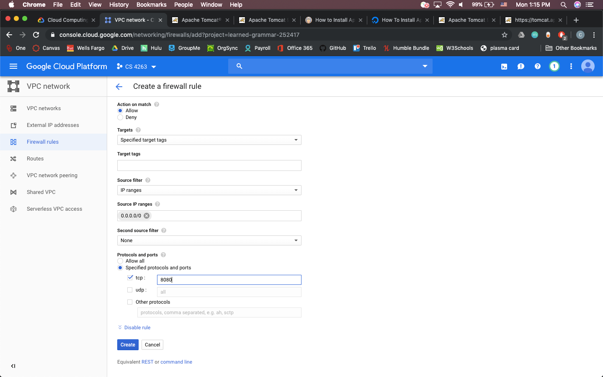

# Setting up a Java Webserver on GCP’s Compute Engine

1. Set up VM

    a. Log into GCP, go to the compute engine menu and select create instance.

    b. Name your instance, select the smallest machine type, choose Debian 9 as the OS and be sure to enable HTTP traffic

    c. Launch your new VM. Congratulations! You now have a small Linux machine to launch your webserver from!
1. Set up Apache Tomcat

    a. In this tutorial we use Tomcat as our webserver. For the most part follow this guide to set up your webserver:  
      - https://www.digitalocean.com/community/tutorials/install-tomcat-9-debian-9  
    
    b. On step 6 of this tutorial you have to enable port 8080 via the GCP firewall menus.  
      - Under your VM instance details > Network Interfaces select view details   
      - From here select firewall rules on the left  
      - Select create firewall rule  
      - Give your rule a name, set source filter to 0.0.0.0/0 (all ip addresses), and enable port tcp:8080.  
        
      - Select create and you should be finished.  

    c. You should now be able to finish the linked tutorial and connect to your tomcat server and use the Application Manager.
1. Build random number generator WAR.

    a. Next we will use the following tutorial as a base to develop our random number generator.
      - https://tcserver.docs.pivotal.io/3x/docs-tcserver/topics/tutwebapp.html#tutwebapp-web-xml-file

    b. For step 3 go ahead and build the directories in the home of your virtual machine, not in the tomcat distribution. We will follow these steps to build a WAR file, that we will eventually download onto your machine, and then deploy using the Tomcat Application Manager.

    c. Create all of the files as specified, except the build.xml file where you will change the tcserver.home property to the directory containing your tomcat installation. The rest of the provided xml file should work.

    d. Stop the above tutorial at step 10, as now the deployment and compilation information begin to diverge. In order to compile the program, you need to give the compiler temporary access to the java libraries in the tomcat distribution. Do this by calling
    ```sh
    sudo chmod -R 757 /opt/tomcat/bin /opt/tomcat/lib
    ```
    e. Then compile your code by calling
    ```sh
    ant all
    ```
    in the directory in which you have your build.xml file

    f. After this secure your tomcat libraries again by calling
    ```sh
    sudo chmod -R 750 /opt/tomcat/bin /opt/tomcat/lib
    ```
      - Note that changing access permissions is due to one of the steps in the tutorial for setting up tomcat, and I was not able to figure out how to implement this process in a lighter fashion.

    g. You should now have a compiled WAR file in ~/helloworld/dist directoy.  
1. Deploy .WAR file.

    a. Download the .WAR using the settings gear in the upper right of your GCP terminal and typing in the location of your .WAR file.

    b. Go to your_IP:8080/manager/html  
    

    c. From here you can upload your .WAR file and deploy it using this tomcat manager.

    d. Congratulations! You can now view your test webserver. You can view the servlet by clicking on the servlet hyperlink on this home page.
1. Customize servlet

    a. You can now customize the servlet file in your home directory, compile, test, and deploy a random number generator by adding the desired code in Hello.java file and following steps 3 and 4 to get your finished product.
