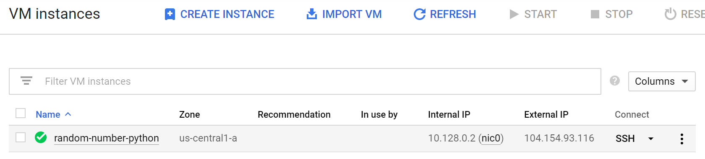

# Compute Engine + Python

## VM Setup
1. Log into the [VM Instances](https://console.cloud.google.com/compute/instances) section of the Google Cloud Platform Console.  
1. Create a new VM instance.  
   
1. Pick **f1-micro** for the machine type (this application is not resource-intensive).  
1. Ensure that **Debian GNU/Linux 9 (stretch)** is the selected boot disk.  
1. Allow HTTP and HTTPS traffic (otherwise this wouldn't be a very effective web service).
   
1. Click **Create** to create the instance. You should see the instance in your instance list:  
   
1. Connect to the VM instance over SSH.  
   

## Install System Packages
Debian ships with Python 2.7 for some lame reason even though everybody uses Python 3. We're also using [NGINX](https://www.nginx.com/) as a reverse proxy.

To install both, run this:
```sh
sudo apt update
sudo apt install nginx python3-pip python3-venv
```

## Project Setup
Make a new directory for the Python project:
```sh
mkdir random-number
cd random-number
```

Create a virtual environment for Python:
```sh
python3 -m venv .
```

We're using [Flask](https://palletsprojects.com/p/flask/) (web framework) and [uWSGI](https://uwsgi-docs.readthedocs.io/en/latest/) (Python web server) for this application, so install both:
```sh
bin/pip install flask uwsgi
```

## Project Code
Create this file in the project directory:  

*random-number<span></span>.py*  
```py
# Main application code for the random number service

from flask import Flask
from random import randint

# New Flask app
app = Flask(__name__)

# Run this code when navigating to http://<hostname>/
@app.route('/')
def hello():
    # Calculate and return a random number
    return '%s' % randint(1, 1000000)

# Run the Flask app if this file is run by itself (instead of being imported)
if __name__ == '__main__':
    app.run()
```

## uWSGI Setup
uWSGI, among other things, is a web server that forwards web requests to a [WSGI](https://www.python.org/dev/peps/pep-3333/)-compliant Python callable object, then sends the response back to the web client.

Create this file in the project directory:

*uwsgi.ini*
```ini
[uwsgi]
; Run the `app` object contained in the Python module `random-number`
module = random-number:app

; This is the master process, with up to 5 child processes
master = true
processes = 5

; Use a POSIX socket (safer than exposing a port)
socket = random-number.sock
chmod-socket = 600
; Delete the socket when finished
vacuum = true

; Shut application down on SIGTERM instead of brutally reloading the stack
die-on-term = true
```

Now we can run the application by calling uWSGI:
```sh
bin/uwsgi --ini uwsgi.ini
```

Though that's not very useful without a reverse proxy set up to forward web requests to the POSIX socket.

## NGINX setup
We're going to modify `/etc/nginx/nginx.conf`. Open it with your favoite text editor. You're likely going to need `sudo`.

On the line that says `user www-data;` (probably the first line), replace `www-data` with your current username. Ideally NGINX would run as its own user, but that's not really important for something as simple as this.

Right underneath `http {`, add this:
```
server {
    # Make this the default server for these ports
    listen 80 default_server;
    listen [::]:80 default_server;

    # Route for just the hostname
    location / {
        # Pass to uWSGI
        include uwsgi_params;
        uwsgi_pass unix:///home/jmartindale98/random-number/random-number.sock;
    }
}
```

Save the file.

NGINX has a default configuration that declares a default server for port 80. This will conflict with the server we added above. The easiest way to get around this is to just remove the configuration:

```sh
sudo rm /etc/nginx/sites-enabled/default
```

`default` is actually a symbolic link to `/etc/nginx/sites-available/default`, so nothing was really lost. Common practice is to add all the servers you might use as separate configuration files in `/etc/nginx/sites-available`, and then add a symbolic link inside of `/etc/nginx/sites-enabled` pointing to that file. But that's a little extra effort and we ony have one server, so that's not important.

Test the NGINX configuration:
```
$ sudo nginx -t
nginx: the configuration file /etc/nginx/nginx.conf syntax is ok
nginx: configuration file /etc/nginx/nginx.conf test is successful
```

Restart NGINX:
```sh
sudo service nginx restart
```

## systemd Servive
Right now the random number service doesn't work. If you visit the IP address of the VM listed in the VM Instance List, you're not going to be very happy:  


This is because while NGINX is running, it's just proxying web requests to a web server. That web server isn't running, so let's fix that:

```sh
bin/uwsgi --ini uwsgi.ini
```

```
[uWSGI] getting INI configuration from uwsgi.ini
*** Starting uWSGI 2.0.18 (64bit) on [Sat Sep 14 21:41:47 2019] ***
compiled with version: 6.3.0 20170516 on 14 September 2019 20:42:52
os: Linux-4.9.0-9-amd64 #1 SMP Debian 4.9.168-1+deb9u5 (2019-08-11)
nodename: python
machine: x86_64
clock source: unix
detected number of CPU cores: 1
current working directory: /home/jmartindale98/random-number
detected binary path: /home/jmartindale98/random-number/bin/uwsgi
!!! no internal routing support, rebuild with pcre support !!!
your processes number limit is 2282
your memory page size is 4096 bytes
detected max file descriptor number: 1024
lock engine: pthread robust mutexes
thunder lock: disabled (you can enable it with --thunder-lock)
uwsgi socket 0 bound to UNIX address random-number.sock fd 3
Python version: 3.5.3 (default, Sep 27 2018, 17:25:39)  [GCC 6.3.0 20170516]
*** Python threads support is disabled. You can enable it with --enable-threads ***
Python main interpreter initialized at 0x55f7cfa8ab50
your server socket listen backlog is limited to 100 connections
your mercy for graceful operations on workers is 60 seconds
mapped 437424 bytes (427 KB) for 5 cores
*** Operational MODE: preforking ***
WSGI app 0 (mountpoint='') ready in 0 seconds on interpreter 0x55f7cfa8ab50 pid: 834 (default app)
*** uWSGI is running in multiple interpreter mode ***
spawned uWSGI master process (pid: 834)
spawned uWSGI worker 1 (pid: 836, cores: 1)
spawned uWSGI worker 2 (pid: 837, cores: 1)
spawned uWSGI worker 3 (pid: 838, cores: 1)
spawned uWSGI worker 4 (pid: 839, cores: 1)
spawned uWSGI worker 5 (pid: 840, cores: 1)
[pid: 840|app: 0|req: 1/1] 104.222.25.33 () {42 vars in 732 bytes} [Sat Sep 14 21:41:48 2019] GET / => generated 6 by
tes in 2 msecs (HTTP/1.1 200) 2 headers in 78 bytes (1 switches on core 0)
```

However, this is kind of inconvenient because every time the VM starts up we need to start the server. The solution to this is to make a service that starts our server automatically.

Create `/etc/systemd/system/random-number.service` in your favorite text editor (you're likely going to need `sudo`). Replace `<username>` with your current username:

```ini
[Unit]
Description=uWSGI instance to serve random numbers
After=network.target

[Service]
User=<username>
Group=<username>
WorkingDirectory=/home/<username>/random-number
Environment="PATH=/home/<username>/random-number/bin"
ExecStart=/home/<username>/random-number/bin/uwsgi --ini uwsgi.ini

[Install]
WantedBy=multi-user.target
```

Start and enable the service:
```sh
sudo systemctl start random-number
sudo systemctl enable random-number
```

If everything worked out, you should get a nice success message in your console when you check its status:
```sh
sudo systemctl status random-number
```
```
● random-number.service - uWSGI instance to serve random numbers
   Loaded: loaded (/etc/systemd/system/random-number.service; enabled; vendor preset: enabled)
   Active: active (running) since Sat 2019-09-14 21:57:13 UTC; 3s ago
 Main PID: 1007 (uwsgi)
    Tasks: 6 (limit: 4915)
   CGroup: /system.slice/random-number.service
           ├─1007 /home/jmartindale98/random-number/bin/uwsgi --ini uwsgi.ini
           ├─1009 /home/jmartindale98/random-number/bin/uwsgi --ini uwsgi.ini
           ├─1010 /home/jmartindale98/random-number/bin/uwsgi --ini uwsgi.ini
           ├─1011 /home/jmartindale98/random-number/bin/uwsgi --ini uwsgi.ini
           ├─1012 /home/jmartindale98/random-number/bin/uwsgi --ini uwsgi.ini
           └─1013 /home/jmartindale98/random-number/bin/uwsgi --ini uwsgi.ini
Sep 14 21:57:13 python uwsgi[1007]: mapped 437424 bytes (427 KB) for 5 cores
Sep 14 21:57:13 python uwsgi[1007]: *** Operational MODE: preforking ***
Sep 14 21:57:13 python uwsgi[1007]: WSGI app 0 (mountpoint='') ready in 0 seconds on interpreter 0x56524dd033c0 pid: 
1007 (default app)
Sep 14 21:57:13 python uwsgi[1007]: *** uWSGI is running in multiple interpreter mode ***
Sep 14 21:57:13 python uwsgi[1007]: spawned uWSGI master process (pid: 1007)
Sep 14 21:57:13 python uwsgi[1007]: spawned uWSGI worker 1 (pid: 1009, cores: 1)
Sep 14 21:57:13 python uwsgi[1007]: spawned uWSGI worker 2 (pid: 1010, cores: 1)
Sep 14 21:57:13 python uwsgi[1007]: spawned uWSGI worker 3 (pid: 1011, cores: 1)
Sep 14 21:57:13 python uwsgi[1007]: spawned uWSGI worker 4 (pid: 1012, cores: 1)
Sep 14 21:57:13 python uwsgi[1007]: spawned uWSGI worker 5 (pid: 1013, cores: 1)
```
