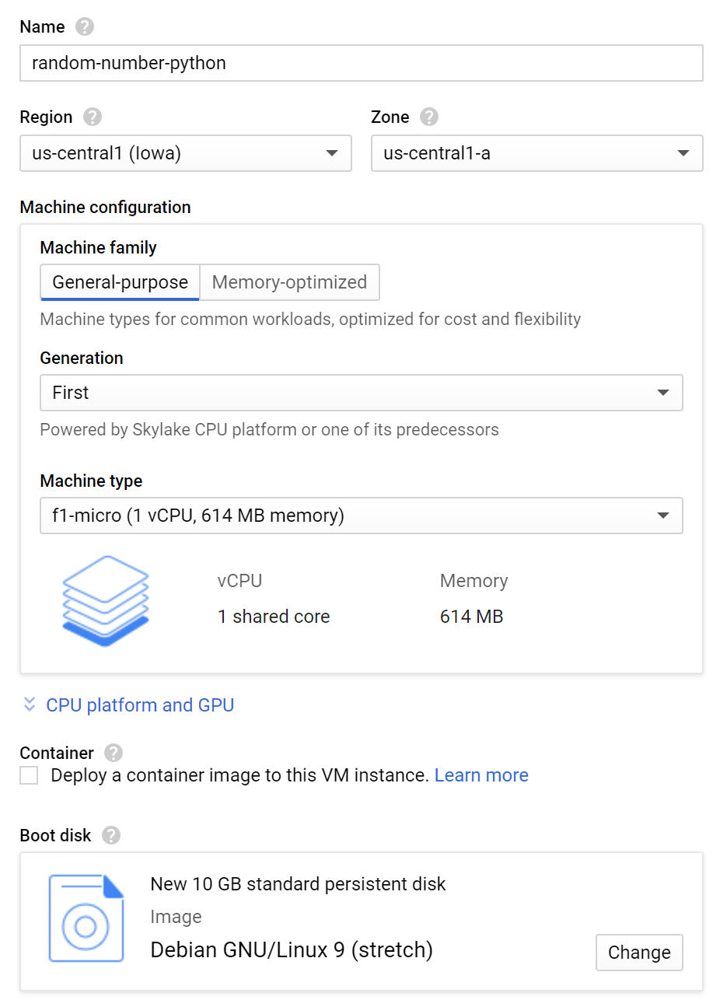
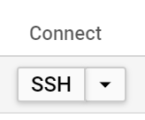

# Compute Engine + Python

## VM Setup
1. Log into the [VM Instances](https://console.cloud.google.com/compute/instances) section of the Google Cloud Platform Console.  
1. Create a new VM instance.  

1. Ensure that **f1-micro** is selected for the machine type (this application is not resource-intensive).  
1. Ensure that **Debian GNU/Linux 9 (stretch)** is the selected boot disk.  
1. Click **Create** to create the instance. You should see the instance in your instance list:  

1. Connect to the VM instance over SSH.  


## Install System Packages
Debian ships with Python 2.7 for some lame reason even though everybody uses Python 3. We're also using [NGINX](https://www.nginx.com/) as a reverse proxy.

To install both, run this:
```sh
sudo apt update
sudo apt install nginx python3-pip python3-venv
```

## Project Setup
Make a new directory for the Python project:
```sh
mkdir random-number
cd random-number
```

Create a virtual environment for Python:
```sh
python3 -m venv .
```

We're using Flask (web framework) and [uWSGI](https://uwsgi-docs.readthedocs.io/en/latest/) (Python web server) for this application, so install both:
```sh
bin/pip install flask uwsgi
```

## Project Code
Create this file in the project directory:  

*random-number<span></span>.py*  
```py
# Main application code for the random number service

from flask import Flask
from random import randint

# New Flask app
app = Flask(__name__)

# Run this code when navigating to http://<hostname>/
@app.route('/')
def hello():
    # Calculate and return a random number
    return '%s' % randint(1, 1000000)

# Run the Flask app if this file is run by itself (instead of being imported)
if __name__ == '__main__':
    app.run()
```

## uWSGI Setup
uWSGI, among other things, is a web server that forwards web requests to a [WSGI](https://www.python.org/dev/peps/pep-3333/)-compliant Python callable object, then sends the response back to the web client.

Create this file in the project directory:

*uwsgi.ini*
```ini
[uwsgi]
; Run the `app` object contained in the Python module `random-number`
module = random-number:app

; This is the master process, with up to 5 child processes
master = true
processes = 5

; Use a POSIX socket (safer than exposing a port)
socket = random-number.sock
chmod-socket = 600
; Delete the socket when finished
vacuum = true

; Shut application down on SIGTERM instead of brutally reloading the stack
die-on-term = true
```

Now we can run the application by calling uWSGI:
```sh
bin/uwsgi --ini uwsgi.ini
```

Though that's not very useful without a reverse proxy set up to forward web requests to the POSIX socket.

## NGINX setup
